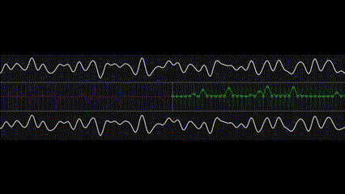
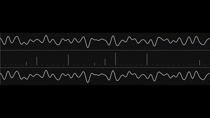

# Fourier_2

## Usage

Download the latest release, extract the files, and run the Fourier_2 executable.

To switch between the transform types, click on the window with your mouse.

## Description

### Top Pane
The top window shows the input waveform (which is composed of multiple sinusoidal waves) 

### Bottom Pane
The bottom window shows the reconstructed waveform based upon the fourier transform.

### Middle Pane

In the full transform mode, this is spilt futher into a left and right pane. The left pane shows the real and imaginary components of the waveform (red=real, blue=imaginary), and the right pane shows the phase and magnitude. The light grey lines demonstrate where the harmonics are located.

In the fast transform mode, middle pane houses lines that show the magnitude of each harmonic of the input waveform. 

## Visual Outputs

### Full Fourier Transform View

### Fast Fourier Transform View
